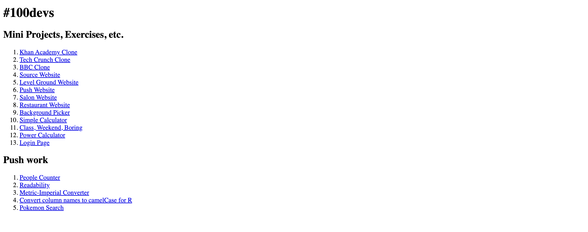

# 100Devs

Repository of small projects from 100Devs. 

What is 100Devs? Check us out [here](https://leonnoel.com/blog/100devs/).

Link of projects: [https://imarijoyborda.com/100devs/](https://imarijoyborda.com/100devs/)

## How To Use
Each folder is one project. Some projects are coding exercises while some are fully functional website or web application. Feel free to check them out!

You can also visit the list of projects [here](https://imarijoyborda.com/100devs/) to view the live sites/applications.

The list is fairly simple for now, but I plan to improve it soon!

## How It's Made
Tech used: HTML, CSS, Bootstrap, and JavaScript.

## Thanks for checking it out!
Check out my other projects:
* [Codie | See your Codewars Stats at a Glance](https://github.com/ijborda/codie)
* [COVID-19 Statistics | A COVID-19 Monitoring App](https://github.com/ijborda/covid19-statistics)
* [Astrie | See NASA APOD Beautifully](https://github.com/ijborda/astrie)